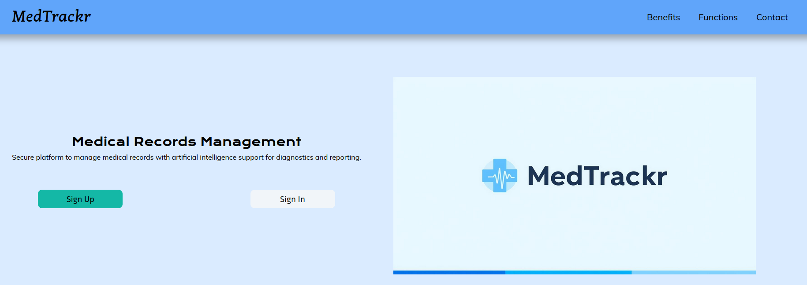
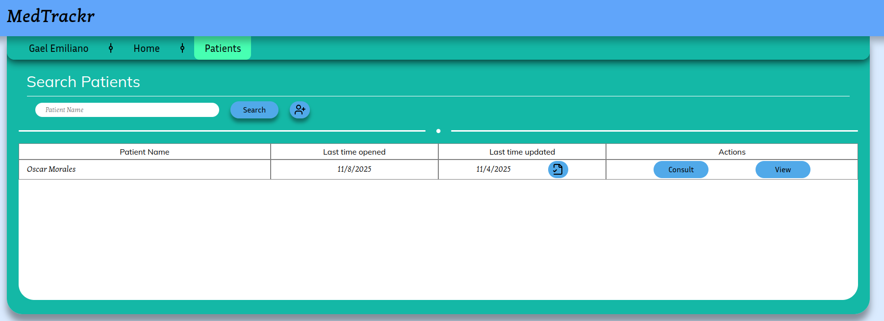
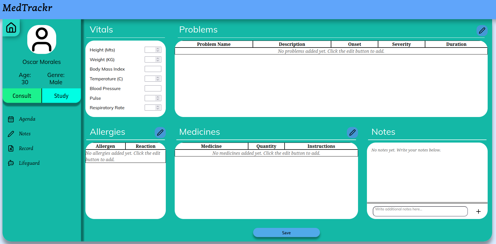
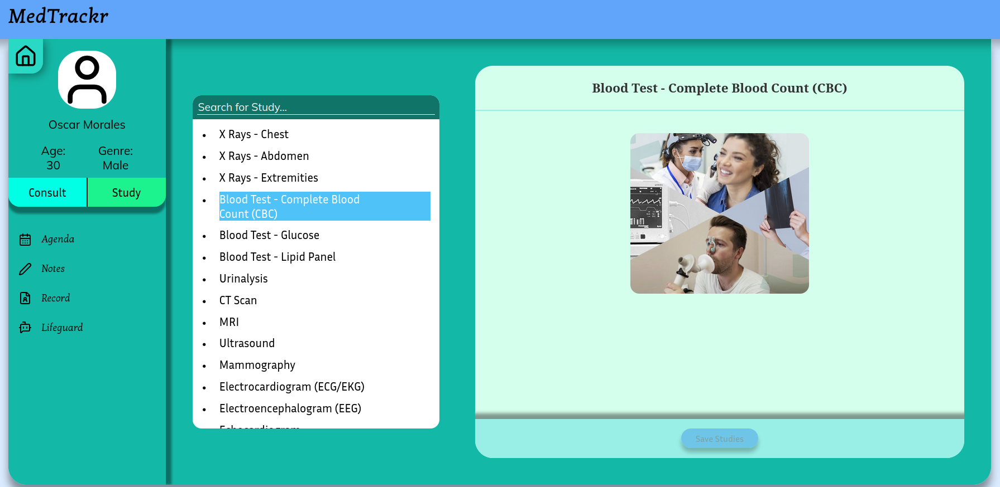
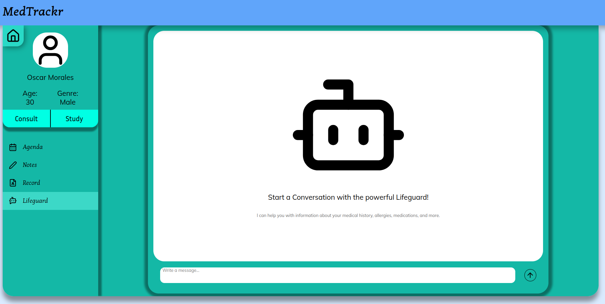

# MedTrackr
An Electronic Health Record (EHR) system embedded with artificial inteligence (AI) for the purpose of powering traditional EHR technologies with the capabilities and advantages of modern AI, facilitating the usage of this systems and provide a better decision making towards improving the health of patients.

## Technologies Used
- **React**
  - Used for the creation of the FrontEnd, helping creating the pages and views as an Single Page Application (SPA).
- **Python / Flask**
  - Used for the creation of API Routes and also for managing the data from the Database to the FrontEnd.
- **MariaDB**
  - Used as the architect for the Relational Database.
- **Ollama**
  - Used for the usage of the phid3 LLM model, training it for the objetive of the system.
- **Docker**
  - Used to compose multiple services such as MariaDB, Ollama and phpMyAdmin for Database visualization.

## How to setup
Refer to the README.md files from the respective services of the server folder, as those will help with the modular instalation of every component needed for the usage of the system.

## Images of the system

### Developers
- Anaya Garcia Gael Emiliano
- Barocio Rizo Santino Alexandro
- Gonzalez Medina Maria Emma Valeria